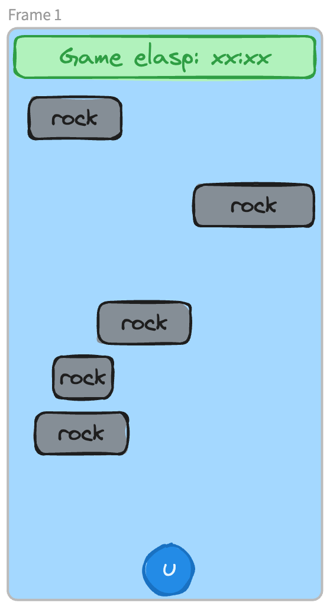

# 7580-canoe-game

CS7580 Sprint 2

MVP demo for a canoe game.

## Deployment page

[Github Page Link](https://chenyangw.github.io/7580-canoe-game/)

[Github Repo Link](https://github.com/chenyangw/7580-canoe-game)

[Demo video](https://drive.google.com/file/d/1FI7C6H90QxQjBGqBaFYX2JJdPEQ3c3A5/view?usp=sharing)

## Design

- Blue circle at bottom represents player, control by A/D key to move left/right.
- Black rectangles represents rockes/obstacles which should be avoided. If player hits a rock, game ends.
- End game and restart option at top of screen.
- When game ends, display time elapsed.

## Wireframe

